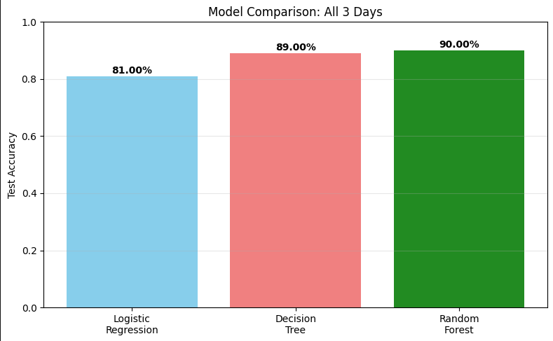
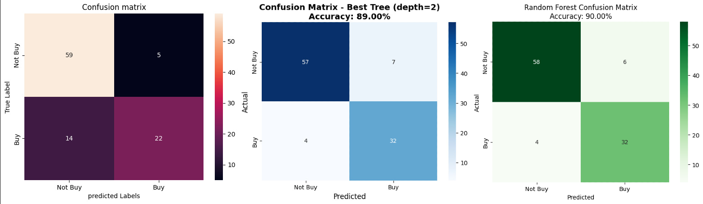
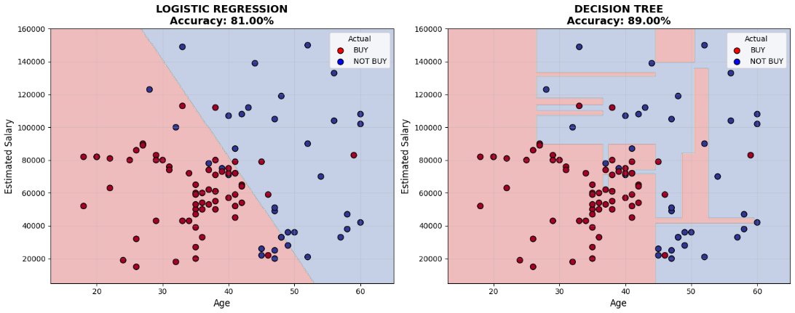
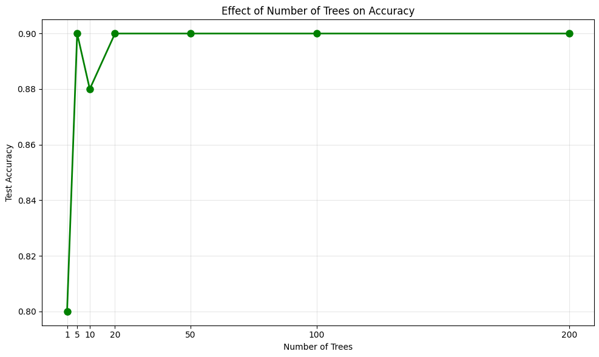
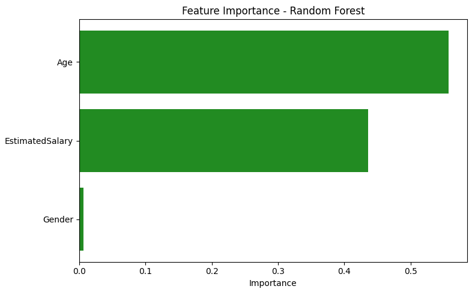
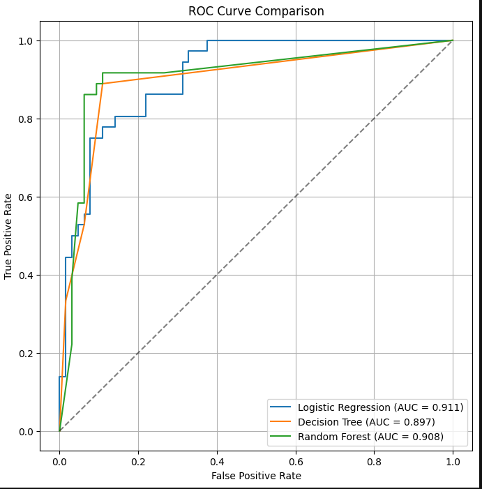

# Social Network Ads Purchase Prediction

## 📋 Project Overview

This project analyzes customer data from a social network to predict whether users will purchase a product based on their demographic information. The dataset contains 400 user records with features including age, gender, and estimated salary.

## 🎯 Objective

Build and compare multiple machine learning models to accurately predict customer purchase behavior and understand which factors influence purchasing decisions.

## 📊 Dataset Features

- **User ID**: Unique identifier for each user
- **Gender**: Male (0) / Female (1)
- **Age**: User's age in years
- **EstimatedSalary**: User's estimated annual salary
- **Purchased**: Target variable (0 = Not Purchased, 1 = Purchased)

## 📊 Visualizations Gallery

### 1. Model Performance Comparison

*Comparison of accuracy across Logistic Regression, Decision Tree, and Random Forest*

### 2. Confusion Matrices Comparison

*Side-by-side comparison of confusion matrices for all three models*

### 3. Decision Boundaries Visualization

*Visualizing how Logistic Regression vs Decision Tree split the feature space*

### 4. Tree Depth Analysis (Overfitting Demonstration)

*Demonstrating overfitting - training accuracy keeps increasing while test accuracy plateaus at depth 2*

### 5. Feature Importance (Random Forest)

*Age is the strongest predictor (56%), followed by salary (44%), with gender having minimal impact*

### 6. ROC Curves Comparison

*ROC curves with AUC scores for all three models - Random Forest achieves highest AUC*

## 🧠 Models Implemented

### Day 2: Logistic Regression
- **Accuracy**: 81%
- **Precision (Buy)**: 0.81
- **Recall (Buy)**: 0.61
- **F1-Score (Buy)**: 0.70

### Day 3: Decision Trees
- **Deep Tree (max_depth=None)**:
  - Training Accuracy: 99.67%
  - Testing Accuracy: 88.00%
  - Gap: 11.67% (overfitting detected)
  - Tree Depth: 10

- **Shallow Tree (max_depth=3)**:
  - Training Accuracy: 93.67%
  - Testing Accuracy: 88.00%
  - Gap: 5.67%
  - Tree Depth: 3

- **Optimal Tree (max_depth=2)**:
  - Test Accuracy: 89.00%

### Day 4: Random Forest
- **Test Accuracy**: 90.00%
- **Precision (Buy)**: 0.84
- **Recall (Buy)**: 0.89
- **F1-Score (Buy)**: 0.87

## 📈 Key Findings

### Feature Importance Summary
From Random Forest analysis:
1. **Age**: 55.8% importance
2. **EstimatedSalary**: 43.6% importance
3. **Gender**: 0.6% importance (negligible)

### Model Performance Summary

| Model | Accuracy | Precision (Buy) | Recall (Buy) | F1-Score (Buy) |
|-------|----------|-----------------|--------------|----------------|
| Logistic Regression | 81% | 0.81 | 0.61 | 0.70 |
| Decision Tree (depth=2) | 89% | 0.82 | 0.89 | 0.85 |
| Random Forest (100 trees) | 90% | 0.84 | 0.89 | 0.87 |

### Optimal Tree Depth Analysis
- **Best depth**: 2 (Test accuracy: 89.00%)
- Depths beyond 2 show diminishing returns and overfitting
- Training accuracy continues to increase while test accuracy plateaus

### Random Forest Performance
- **20 trees** achieve optimal performance
- Additional trees beyond 20 provide marginal improvement
- Ensemble method outperforms single decision tree

## 📁 Project Structure

📦 codebasics-bootcamp-social-ads

┣ 📂 images

┣ 📜 social-network-ads.ipynb

┣ 📜 README.md

┗ 📜 requirements.txt
